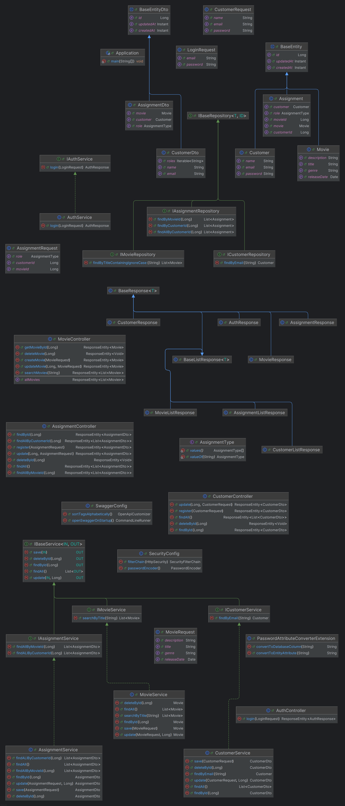

**Customer Access Control API**

Este projeto implementa uma API RESTful para gerir `Customers`, `Movies` e as suas associações (`Assignments`) de um sistema de controlo de acessos.

---

## Tecnologias Utilizadas

* **Java 21** (Corretto)
* **Spring Boot 3.4.5**
* **Spring Data JPA** (Hibernate)
* **H2** (em memória para desenvolvimento) / **MySQL** (produção)
* **SpringDoc OpenAPI** (Swagger UI)
* **JUnit 5** + **Mockito** para testes unitários
* **Lombok** para geração de getters/setters

---

## Pré-requisitos

* Java 21 instalado
* Maven ou Gradle
* MySQL (se não usar H2 em memória)

---

## Configuração

1. Copie o ficheiro `application.properties` no classpath (ex.: `src/main/resources`).

2. Ajuste as propriedades de conexão ao banco de dados:

   ```properties
   spring.datasource.url=jdbc:mysql://localhost:3306/your_db
   spring.datasource.username=seu_usuario
   spring.datasource.password=sua_senha
   ```

3. (Opcional) Para usar H2 em memória, adicione:

   ```properties
   spring.datasource.url=jdbc:h2:mem:testdb
   spring.datasource.driverClassName=org.h2.Driver
   spring.jpa.database-platform=org.hibernate.dialect.H2Dialect
   spring.h2.console.enabled=true
   ```

---

## Execução

### Com Maven

```bash
mvn clean spring-boot:run
```

### Com Gradle

```bash
gradle bootRun
```

O servidor vai arrancar em `http://localhost:8080` por defeito.

Para aceder à documentação Swagger UI:

```
http://localhost:8080/swagger-ui.html
```

---

## Diagrama de Classes

Insira aqui o diagrama de classes do sistema:



---

## Endpoints

> **Base URL:** `/`

### Autenticação

* **POST** `/auth/login`

  * Descrição: Autentica um utilizador e retorna token JWT.
  * Request:

    ```json
    {
      "username": "email@exemplo.com",
      "password": "senha"
    }
    ```
  * Response:

    ```json
    {
      "token": "<jwt>"
    }
    ```

### Customers (`Clientes`)

| Método | URI                 | Descrição                  | Status de Resposta |
| ------ | ------------------- | -------------------------- | ------------------ |
| POST   | `/customers/create` | Cria um novo cliente       | 201 CREATED        |
| PUT    | `/customers/{id}`   | Atualiza cliente existente | 200 OK             |
| GET    | `/customers/{id}`   | Obtém dados de um cliente  | 200 OK             |
| GET    | `/customers`        | Lista todos os clientes    | 200 OK             |
| DELETE | `/customers/{id}`   | Remove um cliente          | 204 NO CONTENT     |

### Movies (`Filmes`)

| Método | URI                        | Descrição                  | Status de Resposta |
| ------ | -------------------------- | -------------------------- | ------------------ |
| POST   | `/movies/create`           | Cria um novo filme         | 201 CREATED        |
| PUT    | `/movies/{id}`             | Atualiza filme existente   | 200 OK             |
| GET    | `/movies/{id}`             | Obtém detalhes de um filme | 200 OK             |
| GET    | `/movies`                  | Lista todos os filmes      | 200 OK             |
| DELETE | `/movies/{id}`             | Remove um filme            | 204 NO CONTENT     |
| GET    | `/movies/search?title={t}` | Pesquisa filmes por título | 200 OK             |

### Assignments (`Atribuições`)

| Método | URI                          | Descrição                                    | Status de Resposta |
| ------ | ---------------------------- | -------------------------------------------- | ------------------ |
| POST   | `/assignments/create`        | Cria uma nova atribuição entre cliente/filme | 201 CREATED        |
| PUT    | `/assignments/{id}`          | Atualiza atribuição existente                | 200 OK             |
| GET    | `/assignments/{id}`          | Obtém detalhes de uma atribuição             | 200 OK             |
| GET    | `/assignments`               | Lista todas as atribuições                   | 200 OK             |
| GET    | `/assignments/customer/{id}` | Lista atribuições por cliente                | 200 OK             |
| GET    | `/assignments/movie/{id}`    | Lista atribuições por filme                  | 200 OK             |
| DELETE | `/assignments/{id}`          | Remove uma atribuição                        | 204 NO CONTENT     |

---

## Testes

Executar testes unitários:

```bash
mvn test
```

ou

```bash
gradle test
```

---

## Contribuições

1. Faça um *fork* do projeto
2. Crie uma *branch* para a sua feature (`git checkout -b feature/NovaFeature`)
3. Faça *commit* das suas alterações (`git commit -m 'Adiciona feature X'`)
4. Envie para o *branch* remoto (`git push origin feature/NovaFeature`)
5. Abra um *Pull Request*

---

## Licença

Este projeto está licenciado sob a [MIT License](LICENSE).
